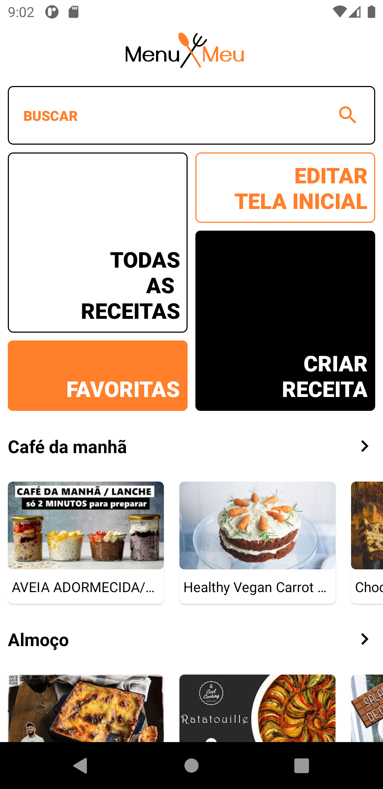
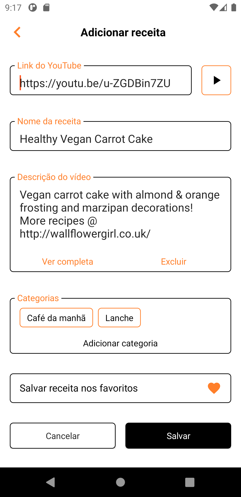
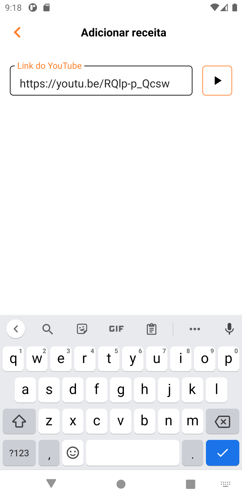
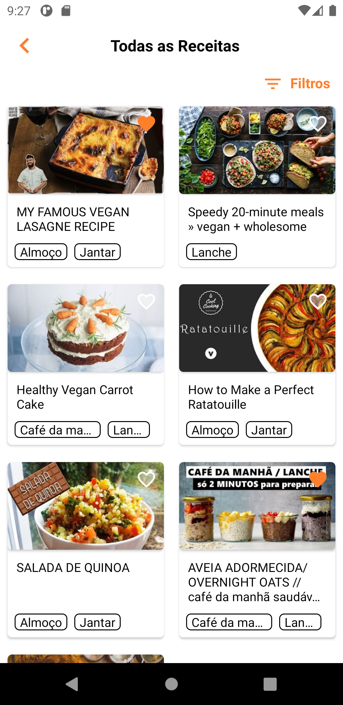
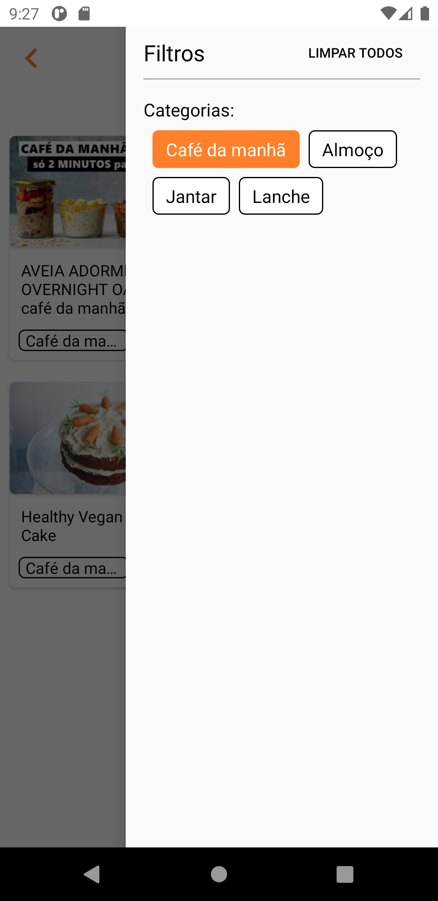
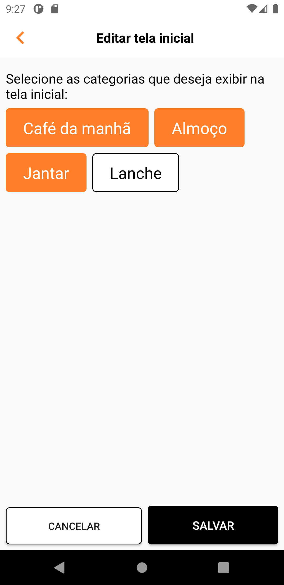
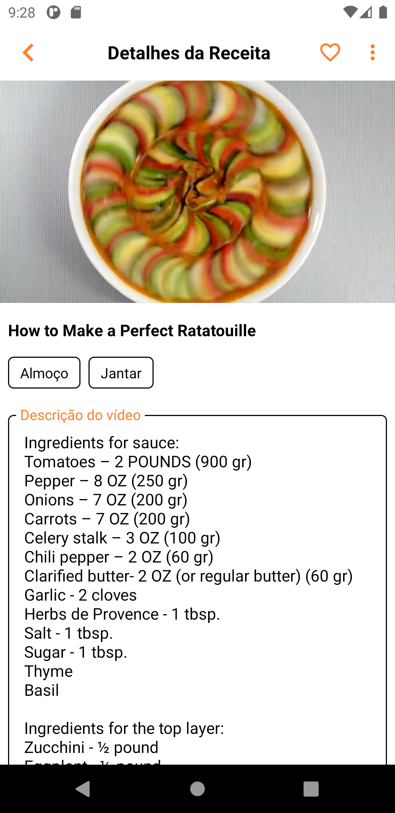
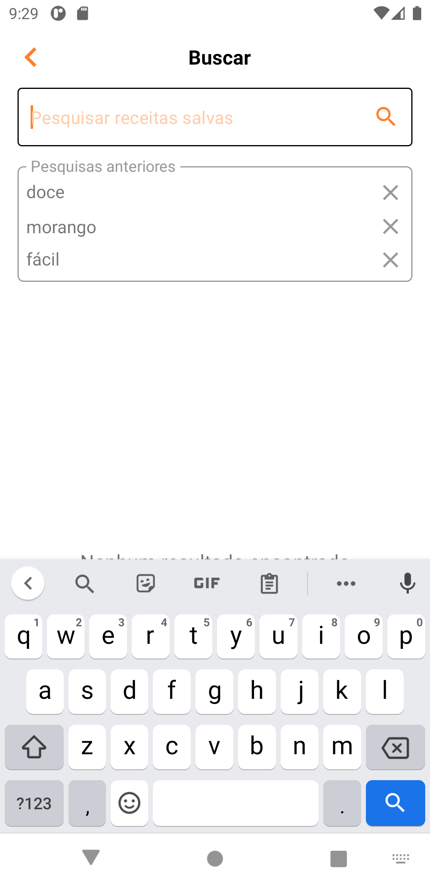
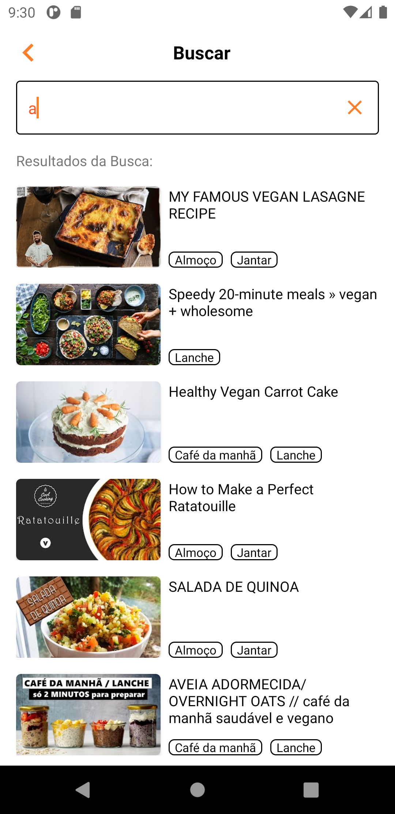

  

### Objetivos
MenuMeu foi um aplicativo desenvolvido para salvar e organizar vídeos de receitas do YouTube. Através do link dos vídeos, ele é capaz de armazenar, organizar e salvar, guardando inclusive a descrição do vídeo e sua lista de ingredientes, capturadas automaticamente da descrição, quando possível. É possível também categorizar essas receitas para organizá-las e encontrá-las mais facilmente, inclusive através de buscas.

### Features

- [x] Cadastro de receita
- [x] Busca de receitas
- [x] Cadastro de categorias
- [x] Recuperar ingredientes

### Tecnologias Utilizadas

<ul>
  <li>Room Persistence Library para persistência de dados usando o SQLite</li>
  <li>Picasso para download de imagens</li>
  <li>Arquitetura MVVM</li>
  <li>Retrofit para consumir API do YouTube</li>
  <li>Coroutines para tarefas assícronas</li>
</ul>

### Demonstração do app

  <kbd>
    
  </kbd>
  &nbsp;&nbsp;&nbsp;&nbsp;
  <kbd>
    
  </kbd>
  &nbsp;&nbsp;&nbsp;&nbsp;
  <kbd>
    
  </kbd>
  &nbsp;&nbsp;&nbsp;&nbsp;
  <kbd>
    
  </kbd>
  &nbsp;&nbsp;&nbsp;&nbsp;
  <kbd>
    
  </kbd>
	&nbsp;&nbsp;&nbsp;&nbsp;
  <kbd>
    
  </kbd>
	&nbsp;&nbsp;&nbsp;&nbsp;
  <kbd>
    
  </kbd>
		&nbsp;&nbsp;&nbsp;&nbsp;
  <kbd>
    
  </kbd>
	&nbsp;&nbsp;&nbsp;&nbsp;
  <kbd>
    
  </kbd>

### Autor

 

Feito com carinho por Joanderson Gonçalves =]

